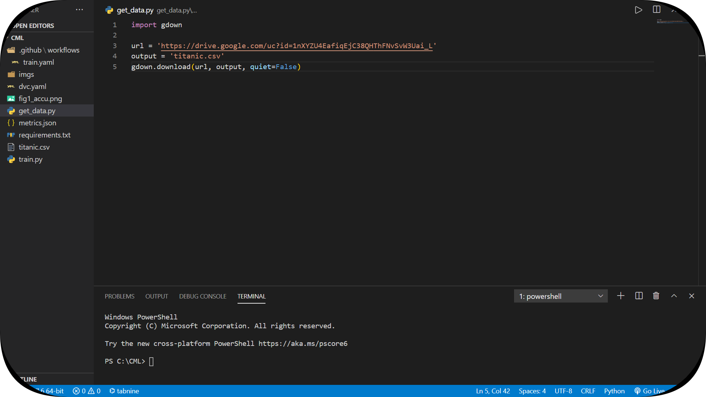
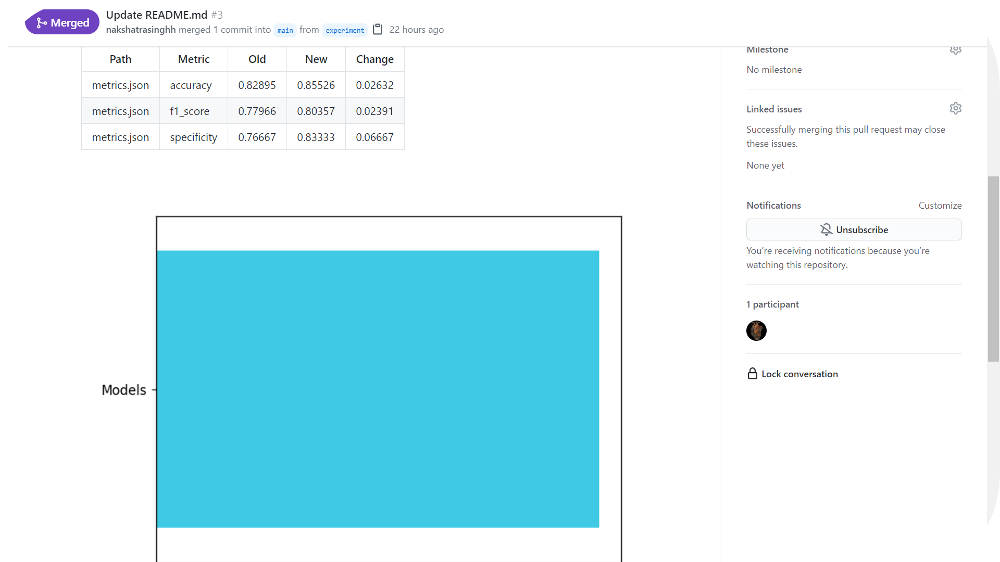

# Data Version Control

**What is DVC?** Data Version Control or DVC is an open-source tool for data science and machine learning projects. Key features:

 - Simple command line Git-like experience. 
 - Does not require installing and maintaining any databases. Does not depend on any proprietary online services.
 - Management and versioning of datasets and machine learning models. Data is saved in S3, Google cloud, Azure, Alibaba cloud, SSH server, HDFS, or even local HDD RAID.
 - Makes projects reproducible and shareable; helping to answer questions about how a model was built.
 - Helps manage experiments with Git tags/branches and metrics tracking.
 - DVC replaces both ad-hoc scripts to track, move, and deploy different model versions; as well as ad-hoc data file suffixes and prefixes.

## Dataset

For this project, I have used the classical [Titanic dataset](https://www.kaggle.com/c/titanic/data) from kaggle. This is a simple and clean practice dataset for classification modelling. It consists of 892 rows and 12 columns. The training set should be used to build your machine learning models. The model will be based on “features” like _passengers’ gender and class_. You can also use feature engineering to create new features. But we won't be dealing with feature engineering in this project. *On the side note, I used the [Rainbow CSV extension](https://marketplace.visualstudio.com/items?itemName=mechatroner.rainbow-csv) for VS-code to make .csv files look more attractive 😅*.

## Getting the Dataset

I have created a python script _([get_data.py](https://github.com/nakshatrasinghh/DVC_TitanicAutomation/blob/main/get_data.py))_ which uses [gdown](https://pypi.org/project/gdown/) to download the dataset directly to the workspace. Gdown helps in downloading large datasets directly saved in google drive. If you use curl/wget, it fails with a large file because of the security warning from google drive. 

## Training Script

⚠️ All the necessary [packages](https://github.com/nakshatrasinghh/DVC_TitanicAutomation/blob/main/requirements.txt) must be installed using pip in order to train the model. ⚠️ Logistic Regression was initially used to train the model. _Accuracy, F1 score, and specificity/recall were stored in a metrics.json file and a simple model accuracy plot was saved in a .png file. Later for testing the workflow, I have used a Random Forest Classifier in the **experiment branch** of the project and merged it with the main branch._ Detailed code of the training script with comments [here](https://github.com/nakshatrasinghh/DVC_TitanicAutomation/blob/main/train.py).

## Github Actions & Workflows

To use Github actions, you need to create a special .yaml/yml file in .github/workflows/ directory. This define the workflow of the project we want to specify when a particular trigger takes place. _In this case, a **[push]** in the repository triggers the workflow._ Detailed code of the workflow with comments [here](https://github.com/nakshatrasinghh/DVC_TitanicAutomation/blob/main/.github/workflows/train.yaml)

⚠️ **NOTE**: Make sure to create your own GitHub personal access token in the developer settings and name YOUR_SECRET_NAME as GH_TOKEN.*_You can name it anything you like, but make sure to change GH_TOKEN on line 11 in [train.yml](https://github.com/nakshatrasinghh/DVC_TitanicAutomation/blob/main/.github/workflows/train.yaml) with YOUR_SECRET_NAME_.* ⚠️

An idea which is often hand in hand with continuous integration is using GitFlow. *_And the idea here is that whenever we want to experiment our project by adding something to our project, changing the parameters, etc, we're going to create a new branch in Git, and have the developement occur on that new branch._* And then ultimately can merge it into the main branch of our project.

## DVC

To setup the pipeline for automation, I'll be using DVC (an open source project by Iterative). I downloaded the dataset using the [get_data.py](https://github.com/nakshatrasinghh/DVC_TitanicAutomation/blob/main/get_data.py) python script in my local workspace, trained the model using the [training script](https://github.com/nakshatrasinghh/DVC_TitanicAutomation/blob/main/train.py), initialized DVC using bash command (dvc init), defined the dvc pipeline stages in [dvc.yaml](https://github.com/nakshatrasinghh/DVC_TitanicAutomation/blob/main/dvc.yaml), ran the [dvc repro](https://dvc.org/doc/command-reference/repro) bash command to regenerate the outputs for each stage and generate plots with .locks files, and finally created the workflow for github actions to automate the complete project in [train.yaml](https://github.com/nakshatrasinghh/DVC_TitanicAutomation/blob/main/.github/workflows/train.yaml).

## Pull Requests

Propose the new changes in a new branch or an exisiting branch (except main), create a pull request in that branch. The runner runs the workflow when a trigger is detected. A [runner](https://github.com/actions/runner) is a server that has the GitHub Actions runner application installed. You can use a runner hosted by GitHub, or you can host your own. ... For GitHub-hosted runners, each job in a workflow runs in a fresh virtual environment. GitHub-hosted runners are based on Ubuntu Linux, Microsoft Windows, and macOS. *_Initially, the runner sets up the jobs, initializes the [container](https://github.com/iterative/cml/blob/master/docker/Dockerfile) (CML docker in this case), runs the [script](https://github.com/actions/github-script) (Github actions checkout), runs the [workflow](https://github.com/nakshatrasinghh/DVC_TitanicAutomation/blob/main/.github/workflows/train.yaml) we produced in (.yaml), stops the container, and finally completes the job._* All these steps are triggered on [push] (pushing a commit in the repo).

## Pull Request Conservations

whenever a GitHub user proposes changes in the code, they can create a pull request in the experiment branch or any other, and a github actions bot will display the Model Metrics (accuracy, f1 score, specificity) and Accuracy Visuals for the changes the user proposed. It can be cumbersome to run the training script locally every time you make changes in the code, with Github Actions this whole process is automated. So, whenever we make changes to the code, we get really fast feedback about what happened in an aesthetically pleasing format and it is easy for other users and collaborators to look at/revisit it.  You can see the report, go back to the commit that created that report and everything at that instance even in a closed pull request. This creates links between the code, the data, the environment, the infrastructure for training, and the results. 

## Message Me
If you have any doubts feel free to click on the social icon you would like to connect with 🤗

&nbsp;&nbsp;
&nbsp;&nbsp;
&nbsp;&nbsp;
&nbsp;&nbsp;

## Support Me
If you liked my work and gained **insightful knowledge**, you can buy me a coffee buying click the button below 😊

